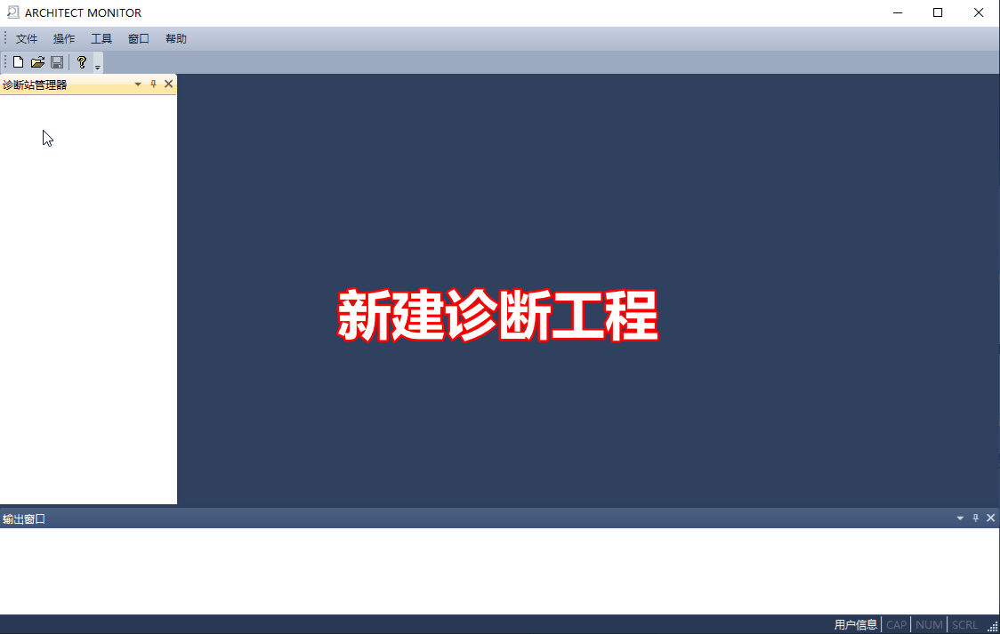
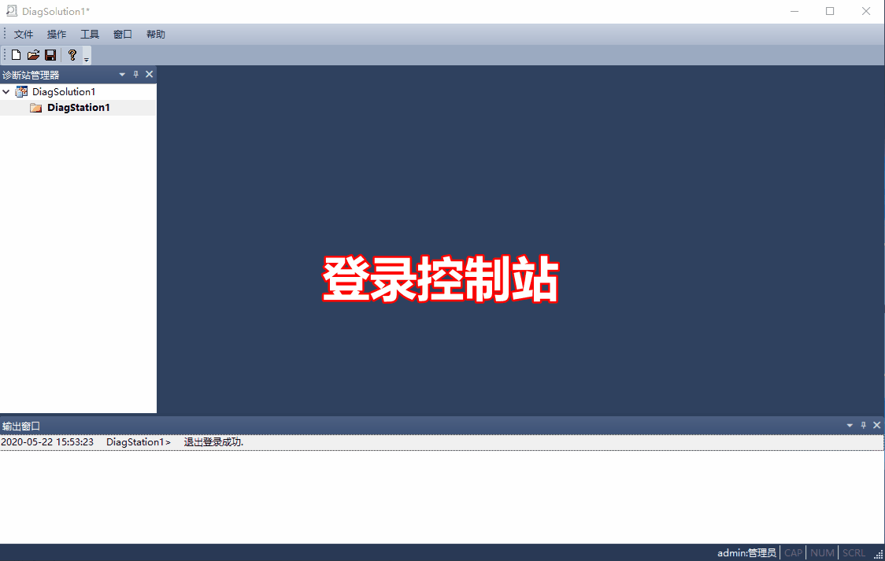

固件升级操作步骤
=====================

PM01模块升级
---------------------

.. hint::
   | 固件文件获取请见 :ref:`最新固件版本`；
   | 此操作将同时升级3个PM01模块，另外两个不需要再次单独升级操作；

---------------------------------------------------------------

CM01模块升级
---------------------

.. hint::
   | 固件文件获取请见 :ref:`最新固件版本`；
   | 只针对当前登录的CM01模块进行升级；
   | 如果要升级其它的CM01，需要先使用该CM01模块登录；
   