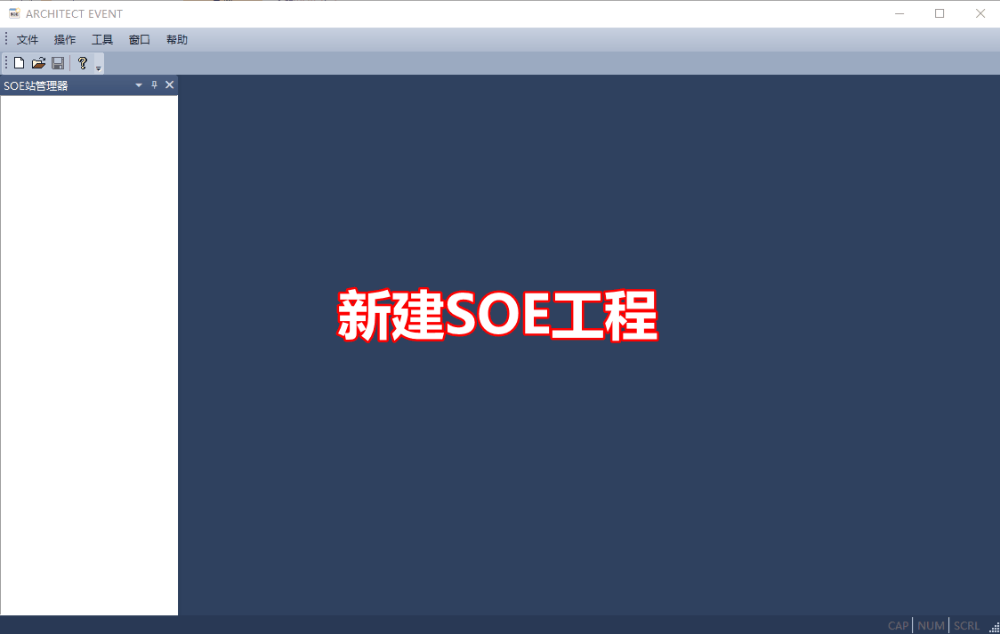

Architect Event
================

仅在Architect Program软件中配置了SOE的功能的变量，在变量值变化时，事件才会被记录下来。配置的步骤请参考 :ref:`软SOE配置`。

收集事件操作
------------------------------------------------------

#. 新建SOE工程
#. 新建站
#. 加载SOE文件
#. 开始收集
