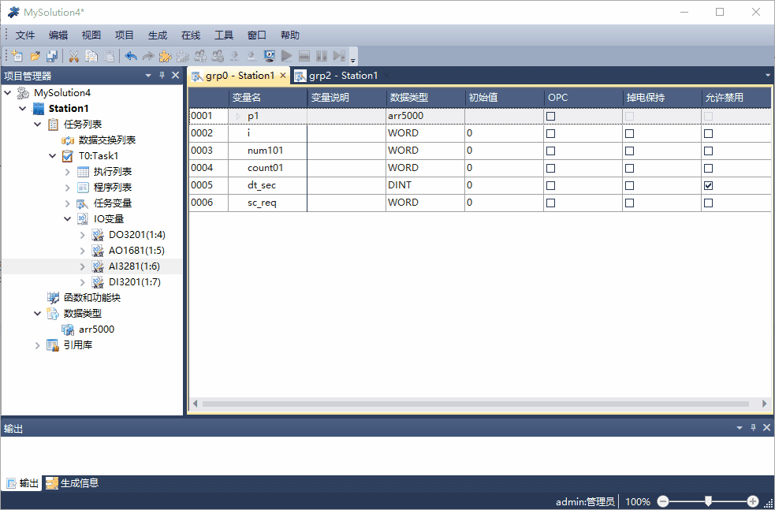

Architect Server
================

在Architect Program软件中配置变量的“OPC”属性；

-------------------------------------------------------------------------------------------------------

配置Architect Server

| 1. 停止服务器
| 2. 配置

   | >添加站
   | >填写站名/配置IP地址：读写控制器数据，填写控制器的实际IP；读写本机仿真器数据，使用IP:127.0.0.1;
   | >获取OPC配置文件(注意连接控制器和仿真器的.opc.csv文件路径不同);
   | >添加所有变量到OPC项列表
   
| 3. 关闭配置界面
