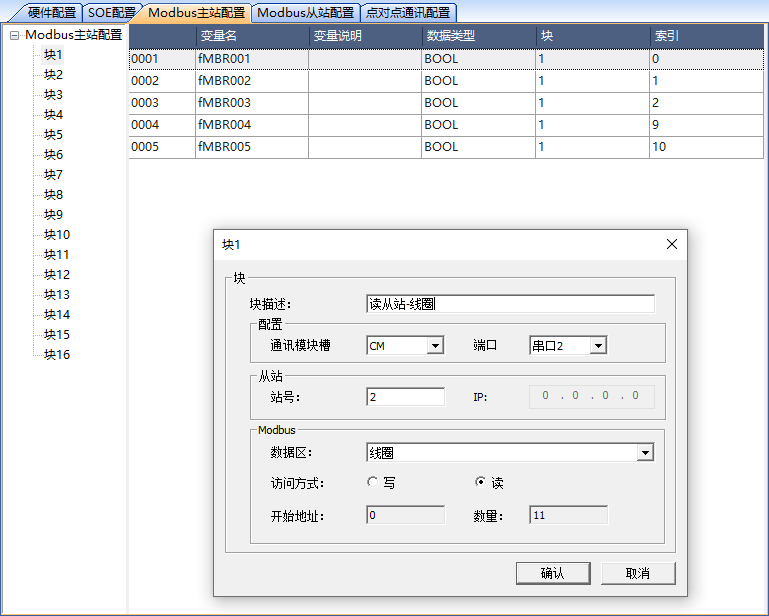
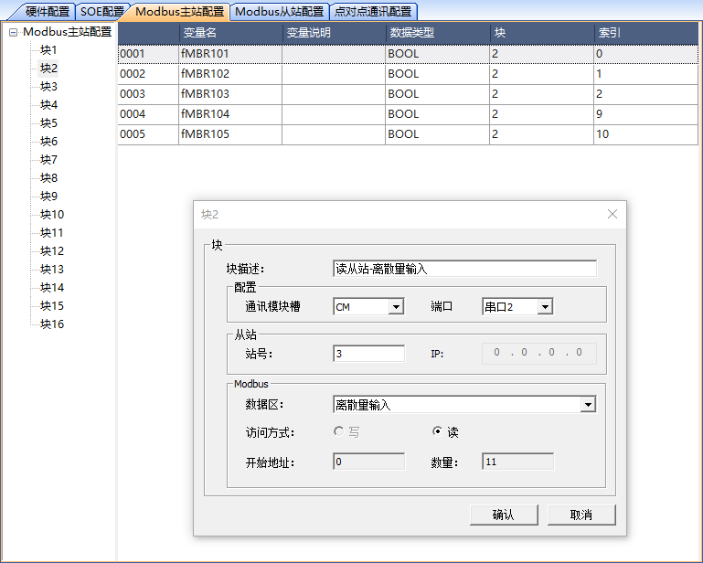
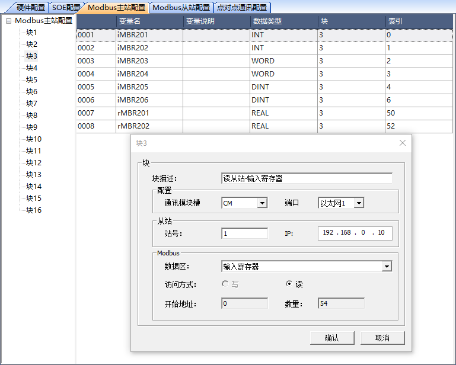
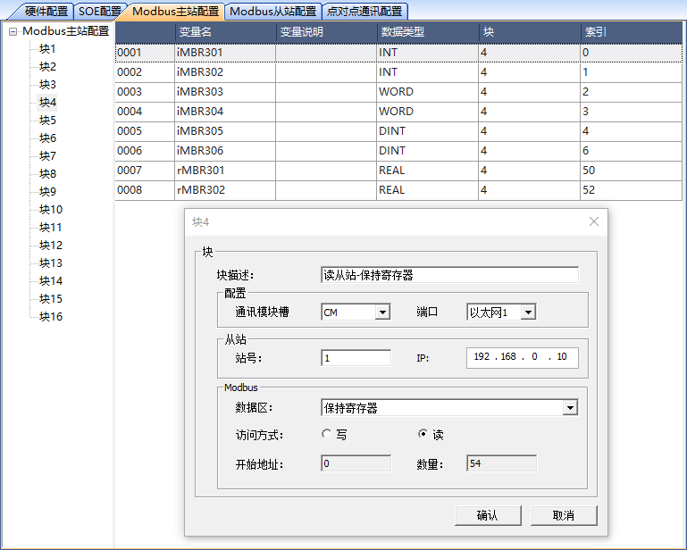
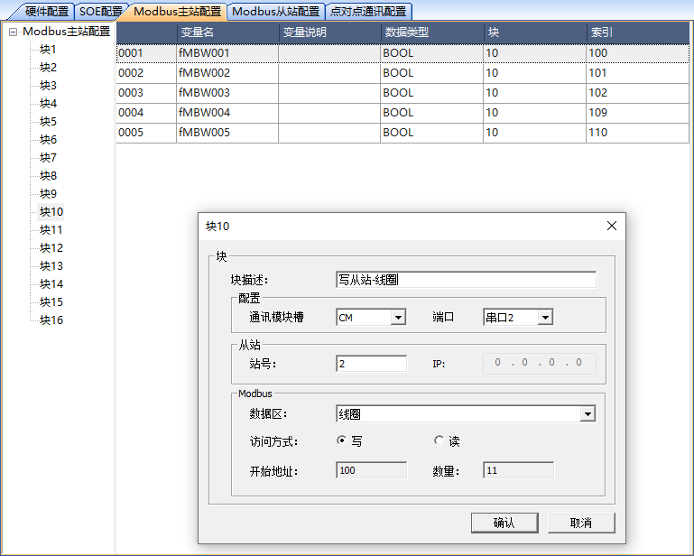
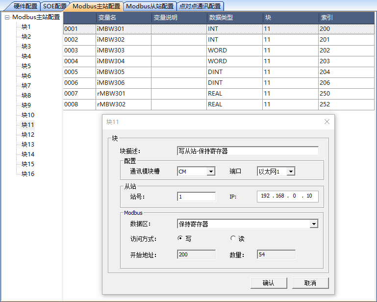

作为Modbus Master
===========================

.. toctree::
   :maxdepth: 2
   
   读从站中数据配置.rst
   向从站中写数据配置.rst
   
---------------------------------------------------------------   

.. image:: images/Modbus主站配置.svg
	
---------------------------------------------------------------
   

   块1属性、变量和索引

   块2属性、变量和索引
   

   块3属性、变量和索引

   块4属性、变量和索引

   块10属性、变量和索引

   块11属性、变量和索引