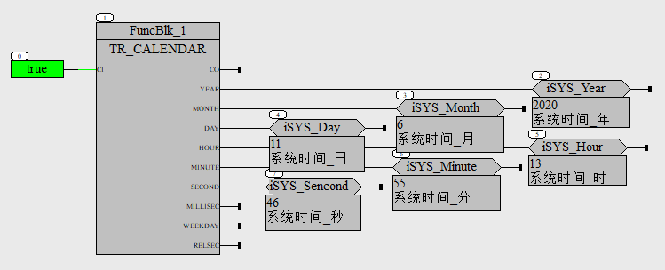
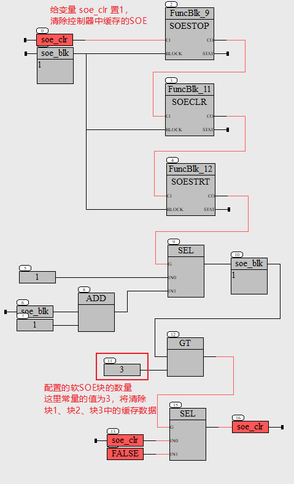
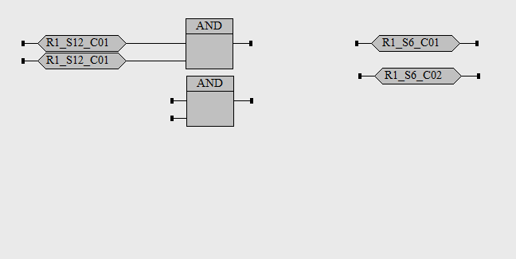
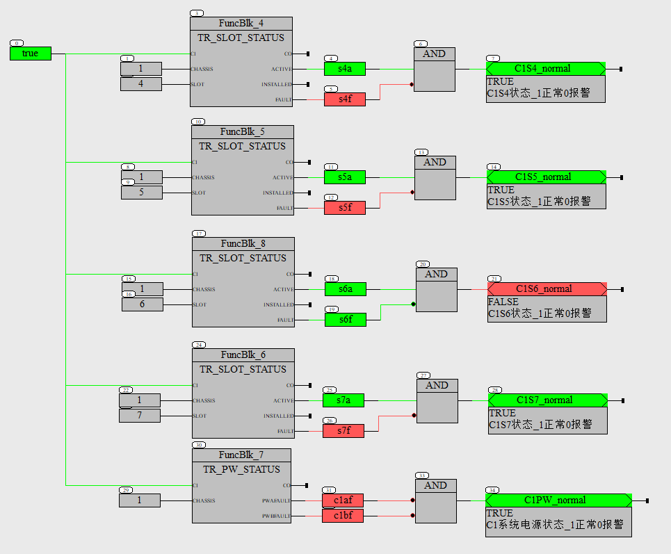
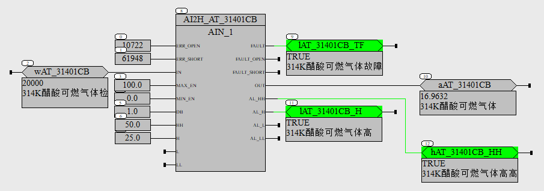

常用功能的演示
==================================

查看控制器的日期时间

----------------------------------

清除不需要的SOE记录

----------------------------------

函数/功能块的输出，赋值给两个变量

----------------------------------

读取IO模块的诊断状态

----------------------------------

模拟量转换和报警

功能块"AIN_1" :download:`点击下载 <./_static/AIN_1.SFBL>`.

----------------------------------

添加引用库

.. image:: images/添加引用库操作.png

