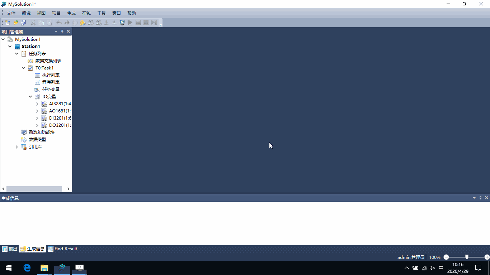
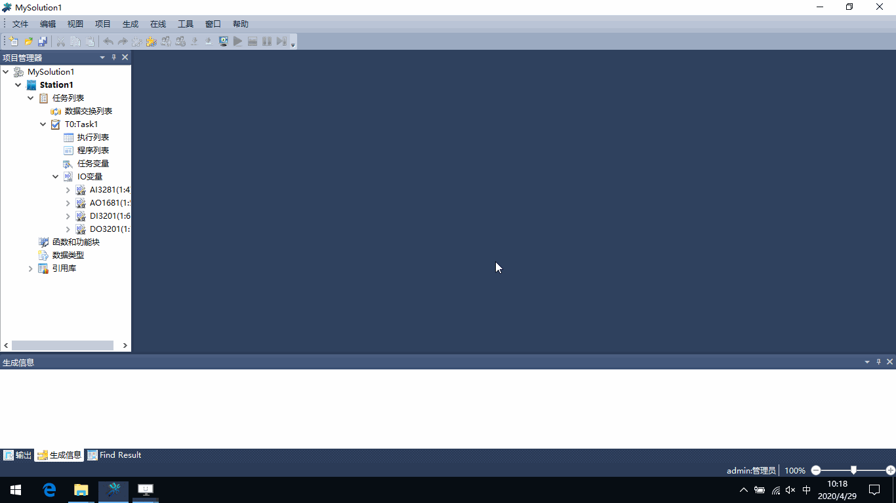

模块参数配置
=========================================

**1. 主处理器模块PM01参数**

IP_BUS通讯参数/周期通讯从站应答超时时间
 | 默认：120微秒；
 | IP_BUS总线方式扩展：每增加1个扩展机架，配置时间加10微秒；
 | 若光纤的长度超过1km：每增加1km，配置时间增加10微秒；
 
校时脉冲参数/校时脉冲源选择
 | 一般情况下，配置为“PM本地”；
  

**2. IO模块参数**

IO模块的“xx通道配置”
 | 通道使能：对于没有接端子板的通道，应取消“通道使能”列的选择；
 | 连线诊断使能：对于没有使用的通道，应取消“连线诊断使能”列的选择；
 

通讯模块CM01参数